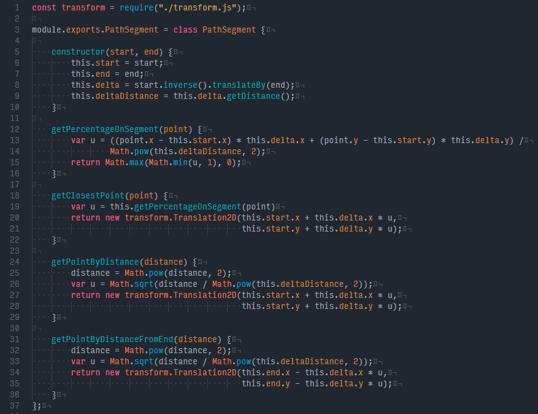
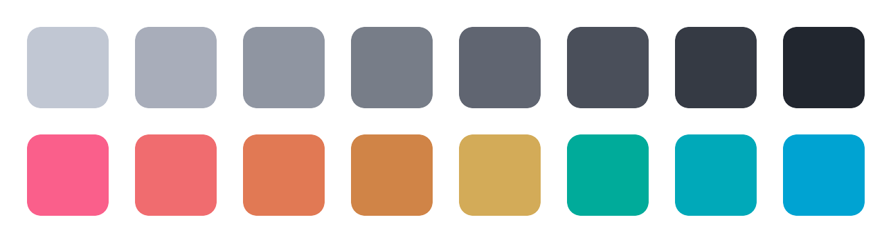

## Summer Night VS Code theme

Note: This is a VS Code port of my popular [Summer Night Syntax Theme](https://atom.io/themes/summer-night-syntax) for Atom

A dark syntax theme with vibrant colors picked using the [HCL color space](http://howlettstudios.com/articles/2017/5/6/the-problem-with-hsv).

The font used in the screenshot is [Input Mono Narrow](http://input.fontbureau.com/). Summer Night is tested to work well with Javascript, CSS/LESS/SCSS, HTML, Java, Python, and C/C++.

### Features

Accent colors are chosen based on two analogous color scales (one warm and one cool) in the HCL space. Hue and chroma values are adjusted slightly to make the colors appear more consistent together but still easy to distinguish.

Monochrome colors are chosen from a scale with equidistant lightness in the HCL color space. Eight shades are generated, with the middle four being used as text colors and the darkest shade as a background color.